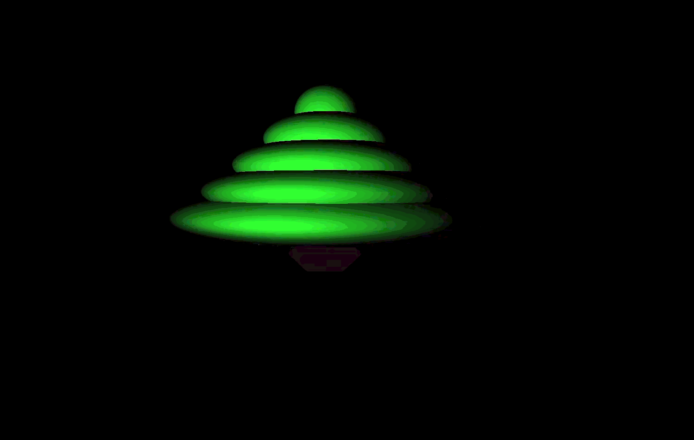

<div class="container">
    <h1 class="main-heading">Tutorial: Christmas Tree</h1>
    <blockquote class="author">by Maximilian Lipski</blockquote>
</div>

This tutorial is designed to show the workflow of the ProceduralShaderFramework when using HLSL-Scripting. Here an animated Christmas Tree is designed on a step-by-step basis.

---

## Step-by-Step

1. [Create](../../unreal.md) a new Unreal Project and Shader 
2. Initialize the variable to track the SDFs within the framework.
```hlsl
float sdfIndex = 0;
```
3. Define the Materials for the Christmas Tree Log and it's Leafs. This results in green leafs and a brown trunk.

```hlsl
MaterialParams logMaterial = makeMaterial(float3(0.067, 0.01, 0.04), float3(0, 0, 0), 1, 32, 0, 0, 0, 0, float3(0, 0, 0), 0, 0, float3(0, 0, 0) );
MaterialParams leafMaterial = makeMaterial(float3(0.164, 1, 0.174), float3(0, 0, 0), 1, 32, 0, 0, 0, 0, float3(0, 0, 0), 0, 0, float3(0, 0, 0) );
```
4. Add the Trunk as a [HexPrism](../sdfs/hexPrism.md) in the Position (0.0, 5.0, -10.0), a Height of 1 and our previously defined logMaterial.

```hlsl
addHexPrism(sdfIndex, float3(0.0, 5.0, -10.0), 1, float3(0, 1, 0), 0, logMaterial);
```

5. Add the leafs as five [Ellipsoids](../sdfs/ellipsoid.md) with decreasing size. Start with the biggest one at Position (0.0, 3.0, -10.0) and the Size (5, 1.5, 5). Smaller ones are smaller by 1 in the xz-Plane and 1.5 lower in y-Coordinates. 
```hlsl
addEllipsoid(sdfIndex, float3(0.0, 3.0, -10.0), float3(5, 1.5, 5), float3(0, 1, 0), 0, leafMaterial);
addEllipsoid(sdfIndex, float3(0.0, 1.5, -10.0), float3(4, 1.5, 4), float3(0, 1, 0), 0, leafMaterial);
addEllipsoid(sdfIndex, float3(0.0, 0.0, -10.0), float3(3, 1.5, 3), float3(0, 1, 0), 0, leafMaterial);
addEllipsoid(sdfIndex, float3(0.0, -1.5, -10.0), float3(2, 1.5, 2), float3(0, 1, 0), 0, leafMaterial);
addEllipsoid(sdfIndex, float3(0.0, -3.0, -10.0), float3(1, 1.5, 1), float3(0, 1, 0), 0, leafMaterial);
```

6. Calculate the camera rotation using the MousePosition and ScreenSize
```hlsl
float3x3 cameraMatrix;
rotateViaMouse(MousePosition, ScreenSize, cameraMatrix);
```

7. Raymarch the Scene
```hlsl
float4 hitPosition;
float3 normal;
MaterialParams hitMaterial;
float3 rayDirection;

raymarchAll(1.0, cameraMatrix, sdfIndex, UV, hitPosition, normal, hitMaterial, rayDirection, Time);
```

8. Apply a Lighting Model of your choice and return the result
```hlsl
float3 color;
applyPhongLighting(hitPosition, float3(2, 1, -2), hitMaterial, normal, color);
return color;
```

9. Animate Christmas Tree
To animate the Tree the Tweening Library can be used. You can chose the animation and play around with the parameters, here the tree is going to move up and down with a Quadratic_In tween in the y-Coordinate and a duration of 1. The result of the tweening is stored in a variable for each [Ellipsoid](../sdfs/ellipsoid.md) and [HexPrism](../sdfs/hexPrism.md) and then used during the definition of the SDF.

```hlsl
float3 ellipsoidPosition0;
float3 ellipsoidPosition1;
float3 ellipsoidPosition2;
float3 ellipsoidPosition3;
float3 ellipsoidPosition4;
float3 logPosition;

tween3D(float3(0.0, 1.5, -10), float3(0.0, 4.5, -10), 1, 1, 0, 1, Time, ellipsoidPosition0);
tween3D(float3(0.0, 0, -10), float3(0.0, 3, -10), 1, 1, 0, 1, Time, ellipsoidPosition1);
tween3D(float3(0.0, -1.5, -10), float3(0.0, 1.5, -10), 1, 1, 0, 1, Time, ellipsoidPosition2);
tween3D(float3(0.0, -3, -10), float3(0.0, 0, -10), 1, 1, 0, 1, Time, ellipsoidPosition3);
tween3D(float3(0.0, -4.5, -10), float3(0.0, -1.5, -10), 1, 1, 0, 1, Time, ellipsoidPosition4);
tween3D(float3(0.0, 3.5, -10), float3(0.0, 6.5, -10), 1, 1, 0, 1, Time, logPosition);

addHexPrism(sdfIndex, logPosition, 1, float3(0, 1, 0), 0, logMaterial);

addEllipsoid(sdfIndex, ellipsoidPosition0, float3(5, 1.5, 5), float3(0, 1, 0), 0, leafMaterial);
addEllipsoid(sdfIndex, ellipsoidPosition1, float3(4, 1.5, 4), float3(0, 1, 0), 0, leafMaterial);
addEllipsoid(sdfIndex, ellipsoidPosition2, float3(3, 1.5, 3), float3(0, 1, 0), 0, leafMaterial);
addEllipsoid(sdfIndex, ellipsoidPosition3, float3(2, 1.5, 2), float3(0, 1, 0), 0, leafMaterial);
addEllipsoid(sdfIndex, ellipsoidPosition4, float3(1, 1.5, 1), float3(0, 1, 0), 0, leafMaterial);

```
--- 

## The Result

The resulting HLSL-Code should look like this:
```hlsl
float sdfIndex = 0;
MaterialParams logMaterial = makeMaterial(float3(0.067, 0.01, 0.04), float3(0, 0, 0), 1, 32, 0, 0, 0, 0, float3(0, 0, 0), 0, 0, float3(0, 0, 0) );
MaterialParams leafMaterial = makeMaterial(float3(0.164, 1, 0.174), float3(0, 0, 0), 1, 32, 0, 0, 0, 0, float3(0, 0, 0), 0, 0, float3(0, 0, 0) );


float3 ellipsoidPosition0;
float3 ellipsoidPosition1;
float3 ellipsoidPosition2;
float3 ellipsoidPosition3;
float3 ellipsoidPosition4;
float3 logPosition;

tween3D(float3(0.0, 1.5, -10), float3(0.0, 4.5, -10), 1, 1, 0, 1, Time, ellipsoidPosition0);
tween3D(float3(0.0, 0, -10), float3(0.0, 3, -10), 1, 1, 0, 1, Time, ellipsoidPosition1);
tween3D(float3(0.0, -1.5, -10), float3(0.0, 1.5, -10), 1, 1, 0, 1, Time, ellipsoidPosition2);
tween3D(float3(0.0, -3, -10), float3(0.0, 0, -10), 1, 1, 0, 1, Time, ellipsoidPosition3);
tween3D(float3(0.0, -4.5, -10), float3(0.0, -1.5, -10), 1, 1, 0, 1, Time, ellipsoidPosition4);
tween3D(float3(0.0, 3.5, -10), float3(0.0, 6.5, -10), 1, 1, 0, 1, Time, logPosition);

addHexPrism(sdfIndex, logPosition, 1, float3(0, 1, 0), 0, logMaterial);

addEllipsoid(sdfIndex, ellipsoidPosition0, float3(5, 1.5, 5), float3(0, 1, 0), 0, leafMaterial);
addEllipsoid(sdfIndex, ellipsoidPosition1, float3(4, 1.5, 4), float3(0, 1, 0), 0, leafMaterial);
addEllipsoid(sdfIndex, ellipsoidPosition2, float3(3, 1.5, 3), float3(0, 1, 0), 0, leafMaterial);
addEllipsoid(sdfIndex, ellipsoidPosition3, float3(2, 1.5, 2), float3(0, 1, 0), 0, leafMaterial);
addEllipsoid(sdfIndex, ellipsoidPosition4, float3(1, 1.5, 1), float3(0, 1, 0), 0, leafMaterial);


float3x3 cameraMatrix;
rotateViaMouse(MousePosition, ScreenSize, cameraMatrix);

float4 hitPosition;
float3 normal;
MaterialParams hitMaterial;
float3 rayDirection;

raymarchAll(1.0, cameraMatrix, sdfIndex, UV, hitPosition, normal, hitMaterial, rayDirection, Time);

float3 color;
applyPhongLighting(hitPosition, float3(2, 1, -2), hitMaterial, normal, color);

return color;
```

The resulting shader should look as follows:
    <figure markdown="span">
    { width="500" }
    </figure>