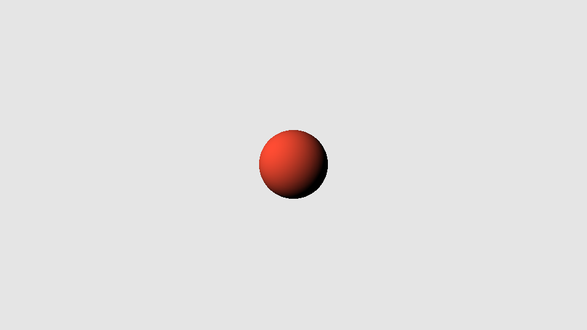

# 🧩 SDF Sphere Raymarch Shader



---

- **Category:** Geometry / SDF Raymarching  
- **Shader Type:** 3D primitive via signed distance field  
- **Input Requirements:** `fragCoord`, `iResolution`  
- **Output:** Raymarched red sphere with basic diffuse lighting

---

## 📌 Notes

- This shader uses **Signed Distance Field (SDF)** and **sphere tracing** to render a 3D sphere.
- Implements **normal estimation** using central differences.
- Provides **diffuse shading** with a fixed directional light.
- A useful base for learning **SDF-based rendering** and **raymarching geometry**.

---

## 🧠 Algorithm

### 🔷 Core Concept

- **Distance Function:** A sphere is defined as `length(pos) - radius`.
- **Raymarching:** The ray steps through space until it hits a surface (`d < threshold`).
- **Normal Calculation:** Central differences estimate surface gradient.
- **Shading:** Simple diffuse lighting based on normal–light dot product.

---

## 🎛️ Parameters

| Name         | Description                            | Type     | Example         |
|--------------|----------------------------------------|----------|------------------|
| `fragCoord`  | Fragment/pixel coordinate              | `vec2`   | Built-in         |
| `iResolution`| Screen resolution                      | `vec2`   | uniform          |
| `radius`     | Sphere radius (in scene function)      | `float`  | `0.3`            |
| `camera_pos` | Camera position                        | `vec3`   | `vec3(0,0,1.5)`  |

---

## 💻 Shader Code

```glsl
float scene(vec3 position) {
    float radius = 0.3;
    return length(position) - radius;
}

vec3 getNormal(vec3 pos, float smoothness) {
    vec3 n;
    vec2 dn = vec2(smoothness, 0.0);
    n.x = scene(pos + dn.xyy) - scene(pos - dn.xyy);
    n.y = scene(pos + dn.yxy) - scene(pos - dn.yxy);
    n.z = scene(pos + dn.yyx) - scene(pos - dn.yyx);
    return normalize(n);
}

float raymarch(vec3 position, vec3 direction) {
    float total_distance = 0.0;
    for (int i = 0; i < 32; ++i) {
        float d = scene(position + direction * total_distance);
        if (d < 0.005) return total_distance;
        total_distance += d;
    }
    return -1.0;
}

void mainImage(out vec4 fragColor, in vec2 fragCoord) {
    vec2 uv = (fragCoord / iResolution.xy) * 2.0 - 1.0;
    uv.x *= iResolution.x / iResolution.y;

    vec3 camera_pos = vec3(0.0, 0.0, 1.5);
    vec3 target = vec3(0.0);
    vec3 forward = normalize(target - camera_pos);
    vec3 right = normalize(cross(vec3(0.0, 1.0, 0.0), forward));
    vec3 up = cross(forward, right);
    vec3 ray_dir = normalize(uv.x * right + uv.y * up + forward);

    float dist = raymarch(camera_pos, ray_dir);

    vec3 color;
    if (dist > 0.0) {
        vec3 hit_pos = camera_pos + ray_dir * dist;
        vec3 normal = getNormal(hit_pos, 0.001);
        vec3 light_dir = normalize(vec3(0.8, 0.6, 1.0));
        float diffuse = max(dot(normal, light_dir), 0.0);
        color = vec3(1.0, 0.3, 0.2) * diffuse;
    } else {
        color = vec3(0.9);
    }

    fragColor = vec4(color, 1.0);
}
```
🔗 [View Full Shader Code on GitHub](https://github.com/friedaxvictoria/procedural_shader_framework/blob/main/shaders/shaders/geometry/SDF_Sphere.glsl)
