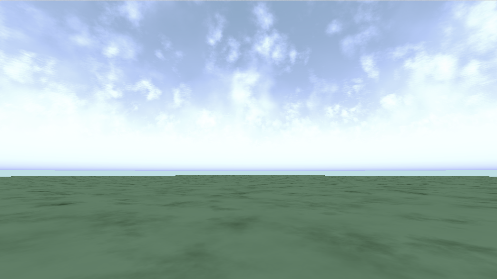

#  🧩 Cloud and Ground Integration Shader



- **Category:** Scene
- **Author:** Xuetong Fu
- **Shader Type:** Volumetric cloud rendering integrated with surface lighting
- **Input Requirements:** `fragCoord`, `iTime`, `iMouse`, `iResolution`, `iChannel0` (noise texture)
- **Output:**  `fragColor` RGBA color (volumetric cloud with light occlusion and dynamic terrain shading)

---

## 🧠 Algorithm

### 🔷 Core Concept
This shader demonstrates **modular integration** of cloud volume rendering and terrain shading using prebuilt components.  
It blends:

- **FBM-based volumetric clouds**
- **Phong-shaded terrain with cloud shadow**
- **Sky gradient background**

and uses reusable modules from the project to handle:

- Noise
- Cloud volume
- Volume lighting context
- Volume lighting functions
- Volume material system
- Material systems
- Lighting context
- Lighting functions

---

## 🎛️ Parameters

### ☁️ Cloud Configuration

| Name            | Value     | Description                                    |
|-----------------|-----------|------------------------------------------------|
| `planetRadius` | `6360.0`   | Ground Y-position, defines sea/ground base |
| `atmosphereTop`| `6420.0`   | Scene top Y-position |
| `mieScaleHeight`     | `1.2`     | Vertical decay factor for Mie scattering                                    |
| `rayleighScaleHeight`| `8.0`     | Vertical decay factor for Rayleigh scattering                               |
| `cloudBase`     | `2.0`     | Height above planet where cloud begins         |
| `cloudThickness`| `8.0`     | Total vertical thickness of the cloud volume   |
| `CLOUD_BASE`    | `planetRadius + cloudBase`  | World height for cloud bottom |
| `CLOUD_TOP`     | `planetRadius + cloudBase + cloudThickness`  | World height for cloud top                     |
| `stepCount`     | `96.0`    | Total steps for volume integration             |
| `PI`                 | `3.14159265359` | Mathematical constant used in phase calculations and normalization     |

### 💡 Lighting Configuration

| Name            | Value                     | Description                          |
|-----------------|---------------------------|--------------------------------------|
| `lightDir`      | `vec3(0.3, 0.5, 0.2)`     | Direction of the light               |
| `lightColor`    | `vec3(2.0, 2.2, 2.8)`     | Bright bluish daylight               |
| `ambient`       | Same as `lightColor`      | Used for both cloud and terrain      |

### 🌍 Scene Bounds & Camera

| Name           | Value                  | Description                                |
|----------------|------------------------|--------------------------------------------|
| `camPos`       | `vec3(0.0, CLOUD_BASE - 0.8, 0.0)` | Below the cloud layer initially |
| `boxMin`       | `vec3(-10.0, 0.0, -10.0)`    | Minimum bounds for any potential SDF geometry in the scene |
| `boxMax`       | `vec3(10.0, 5.0, 10.0)`      | Maximum bounds for potential SDF geometry in the scene     |


---

## 🧱 Shader Code & Includes

This shader imports or assumes the following headers:

```glsl
#include "noise/simplex_noise.glsl"
#include "material/volume_material/vol_mat_params.glsl"
#include "material/volume_material/vol_mat_presets.glsl"
#include "lighting/volume_lighting/vol_lit_context.glsl"
#include "lighting/volume_lighting/phase.glsl"
#include "lighting/volume_lighting/vol_lit.glsl"
#include "lighting/volume_lighting/vol_integration.glsl"
#include "lighting/volume_lighting/vol_occlusion.glsl"

#include "material/material/material_params.glsl"
#include "material/material/material_presets.glsl"
#include "lighting/surface_lighting/lighting_context.glsl"
#include "lighting/surface_lighting/phong.glsl"
```

### Main Entry
```glsl
void mainImage(out vec4 fragColor, in vec2 fragCoord) {
    // === Camera Position ===
    vec3 camPos = vec3(0.0, CLOUD_BASE -0.8, 0.0);

    // === Camera Orientation from Mouse ===
    vec2 m = (iMouse.xy == vec2(0.0)) ? vec2(0.5, 0.1) : iMouse.xy / iResolution.xy;
    float yaw = 6.2831 * (m.x - 0.5);
    float pitch = 1.5 * 3.1416 * (m.y - 0.5);

    float cosPitch = cos(pitch);
    vec3 forward = vec3(
        cosPitch * sin(yaw),
        sin(pitch),
        cosPitch * cos(yaw)
    );
    vec3 right = normalize(cross(forward, vec3(0.0, 1.0, 0.0)));
    vec3 up = normalize(cross(right, forward));
    mat3 camMat = mat3(right, up, forward);

    // === Ray Setup ===
    vec2 uv = (2.0 * fragCoord - iResolution.xy) / iResolution.y;
    vec3 rayDir = normalize(camMat * vec3(uv, 1.5));

    // === Light & Ambient Settings ===
    vec3 lightDir = normalize(vec3(0.3, 0.5, 0.2));
    vec3 lightColor = vec3(2.0, 2.2, 2.8);
    vec3 ambient = lightColor;

    // === Sky Background ===
    vec3 baseSky = mix(vec3(0.690, 0.878, 0.902), vec3(0.529, 0.808, 0.922), smoothstep(0.0, 0.5, rayDir.y));

    // === Ground Intersection and Lighting ===
    float groundHeight = planetRadius;
    float tGround = (groundHeight - camPos.y) / rayDir.y;
    bool hitGround = rayDir.y < -0.01 && tGround > 0.0;

    vec3 groundColor = vec3(0.08, 0.35, 0.05);
    if (hitGround) {
        vec3 hitPos = camPos + tGround * rayDir;
        vec3 normal = vec3(0.0, 1.0, 0.0);
         // === Cloud Occlusion ===
        float occlusion = computeCloudOcclusion(hitPos + normal * 0.1, lightDir);

        // === Apply Shading ===
        LightingContext ctx = createLightingContext(hitPos, normal, -rayDir, lightDir, lightColor, ambient);
        MaterialParams mat = makePlastic(groundColor);
        vec3 litColor = applyPhongLighting(ctx, mat);

        // === Mix with occlusion shadow ===
        vec3 shadowColor = vec3(0.05, 0.12, 0.04);
        groundColor = mix(litColor, shadowColor, occlusion);

        // === Optional: Tone Map ===
        groundColor = groundColor / (groundColor + vec3(2.3, 1.5, 2.3));
    }

    // === Cloud Volume Rendering ===
    VolMaterialParams cloudMat = makeCloud(vec3(1.0));
    vec4 cloudCol = integrateCloud(camPos, rayDir, 80.0, 96.0, lightDir, lightColor, ambient, cloudMat);

    // === Final Color Blending ===
    vec3 finalColor = vec3(0.0);
    
    bool toGround = rayDir.y < -0.01;
    bool toSky = rayDir.y > 0.01;
    bool hasCloud = (rayDir.y > 0.01 && camPos.y < CLOUD_BASE && camPos.y + rayDir.y * 1e4 > CLOUD_BASE) || 
                    (rayDir.y < -0.01 && camPos.y > CLOUD_TOP  && camPos.y + rayDir.y * 1e4 < CLOUD_TOP)  ||
                    (camPos.y >= CLOUD_BASE && camPos.y <= CLOUD_TOP); 
    
    if (toGround && !hasCloud) {
        finalColor = groundColor;
    }
    else if (toGround && hasCloud) {
        finalColor = mix(groundColor, cloudCol.rgb, cloudCol.a);
    }
    else if (toSky && hasCloud) {
        finalColor = mix(baseSky, cloudCol.rgb, cloudCol.a);
    }
    else {
        finalColor = baseSky; 
    }

    fragColor = vec4(clamp(finalColor, 0.0, 1.0), 1.0);
}
```

🔗 [View Full Shader Code on GitHub](https://github.com/friedaxvictoria/procedural_shader_framework/blob/main/shaders/shaders/lighting/volume_lighting/example_vol.glsl)
