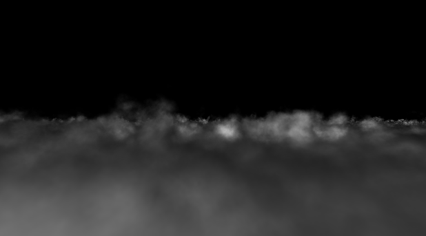

#  🧩 Grayscale Volumetric Cloud Shader



- **Category:** Scene
- **Author:** Xuetong Fu
- **Shader Type:** Full‑screen volumetric raymarch (simplex‑FBM density)
- **Input Requirements:** `fragCoord`, `iTime`, `iMouse`, `iResolution`, `iChannel1` (blue‑noise)
- **Output:**  `fragColor` RGBA color (grayscale cloud density in RGB, alpha = integrated opacity)

---

## 🧠 Algorithm

### 🔷 Core Concept
The shader renders a height‑bounded 3‑D cloud slab.
A 5‑octave simplex‑FBM density field is sampled along view rays; opacity is accumulated with blue‑noise‑jittered step sizes to avoid banding.
No lighting is applied and output is pure grayscale density (RGB = α).

| Stage | Function / Code | Purpose |
|-------|-----------------|---------|
| **Noise Source** | `snoise()` | 3D simplex noise (Ashima Arts) is used as the base wave for FBM |
| **Density Field** | `map(p, oct)` | Generates up to 5 layers (octaves) of FBM noise, then applies a smooth vertical mask between CLOUD_BASE and CLOUD_TOP.|
| **Camera Rays** | inline in `mainImage()` | Creates an orbit camera from mouse yaw/pitch; produces origin `ro` & dir `rd` |
| **Blue‑Noise Jitter** | `texelFetch(iChannel1, px & 1023, 0).x` | Uses a 1024^2 blue‑noise texture to random‑offset the first march step, breaking regular sampling patterns |
| **Integrator** | `integrateDensity()` | Marches up to 190 steps, accumulates front‑to‑back α until exit or opacity ≥ 1 |


Result: smoothly drifting clouds with soft edges.

---
## 🎛️ Parameters

| Name | Description | Range / Unit | Default |
|------|-------------|--------------|---------|
| `iTime` | Global time | seconds | — |
| `iMouse.xy` | Orbit camera yaw / pitch | pixels (0 – `iResolution`) | (0, 0) |
| `iResolution` | Viewport resolution | pixels | — |
| `iChannel1` | Blue‑noise texture for step dithering | `sampler2D` | `vec4(0.0)` if unbound |
| `CAM_POS` | Camera start position | `vec3` | (0, ‑1, ‑6) |
| `CLOUD_BASE / CLOUD_TOP` | Cloud bounds | float | ‑3.0 / 0.6 |

To use this shader outside ShaderToy (e.g., in **Unity** or  **Godot**):

- `iTime` → `_Time.y` in Unity / `TIME` in Godot
- `iResolution` → screen resolution vector
- `iChannel1` → supply your own blue-noise texture
- `iMouse` → remap to your camera controller input

Make sure to adjust the entry point from `mainImage(out vec4 fragColor, in vec2 fragCoord)` to match your rendering pipeline.

---

## 💻 Shader Code & Includes

### 1. Simplex Noise Generator 
The `snoise()` function provides a 3D simplex noise implementation based on Ashima Arts’ classic GLSL version. It uses skewed coordinate space and lattice permutations to evaluate smooth noise with low directional artifacts, ideal for volumetric fields. Internally, it computes contributions from the four nearest simplex corners using gradient vectors, attenuation masks, and normalization factors. This function serves as the foundational noise source for the FBM density field in the cloud shader.

```glsl
// ---------- Simplex Noise Implementation ----------
vec4 mod289(vec4 x) { return x - floor(x * (1.0 / 289.0)) * 289.0; }
vec3 mod289(vec3 x) { return x - floor(x * (1.0 / 289.0)) * 289.0; }

vec4 permute(vec4 x) { return mod289(((x * 34.0) + 1.0) * x); }

float snoise(vec3 v) {
    const vec2 C = vec2(1.0 / 6.0, 1.0 / 3.0);
    const vec4 D = vec4(0.0, 0.5, 1.0, 2.0);

    vec3 i = floor(v + dot(v, C.yyy));
    vec3 x0 = v - i + dot(i, C.xxx);

    vec3 g = step(x0.yzx, x0.xyz);
    vec3 l = 1.0 - g;
    vec3 i1 = min(g, l.zxy);
    vec3 i2 = max(g, l.zxy);

    vec3 x1 = x0 - i1 + C.xxx;
    vec3 x2 = x0 - i2 + C.yyy;
    vec3 x3 = x0 - D.yyy;

    i = mod289(i);
    vec4 p = permute(permute(permute(
        i.z + vec4(0.0, i1.z, i2.z, 1.0))
        + i.y + vec4(0.0, i1.y, i2.y, 1.0))
        + i.x + vec4(0.0, i1.x, i2.x, 1.0));

    float n_ = 0.142857142857;
    vec3 ns = n_ * D.wyz - D.xzx;

    vec4 j = p - 49.0 * floor(p * ns.z * ns.z);
    vec4 x_ = floor(j * ns.z);
    vec4 y_ = floor(j - 7.0 * x_);

    vec4 x = x_ * ns.x + ns.yyyy;
    vec4 y = y_ * ns.x + ns.yyyy;
    vec4 h = 1.0 - abs(x) - abs(y);

    vec4 b0 = vec4(x.xy, y.xy);
    vec4 b1 = vec4(x.zw, y.zw);
    vec4 s0 = floor(b0) * 2.0 + 1.0;
    vec4 s1 = floor(b1) * 2.0 + 1.0;
    vec4 sh = -step(h, vec4(0.0));

    vec4 a0 = b0.xzyw + s0.xzyw * sh.xxyy;
    vec4 a1 = b1.xzyw + s1.xzyw * sh.zzww;

    vec3 p0 = vec3(a0.xy, h.x);
    vec3 p1 = vec3(a0.zw, h.y);
    vec3 p2 = vec3(a1.xy, h.z);
    vec3 p3 = vec3(a1.zw, h.w);

    vec4 norm = 1.79284291400159 - 0.85373472095314 *
        vec4(dot(p0, p0), dot(p1, p1), dot(p2, p2), dot(p3, p3));
    p0 *= norm.x;
    p1 *= norm.y;
    p2 *= norm.z;
    p3 *= norm.w;

    vec4 m = max(0.6 - vec4(
        dot(x0, x0), dot(x1, x1), dot(x2, x2), dot(x3, x3)
    ), 0.0);
    m *= m;

    return 42.0 * dot(m * m, vec4(
        dot(p0, x0), dot(p1, x1), dot(p2, x2), dot(p3, x3)));
}

float noise(vec3 x) {
    return snoise(x);
}
```

### 2. Density Field Function
The `map()` function computes the cloud density at a point in 3D space. It first moves the point over time to create motion, then adds together up to 5 layers of simplex noise (FBM), each with higher frequency and lower strength. A second noise signal (`g`) helps make the shape less uniform. The result is multiplied by a smooth height-based mask between `CLOUD_BASE` and `CLOUD_TOP`, so the cloud fades softly at the top and bottom. At the end, it adjusts the density value with a scale and offset. This function returns a value that tells how “full” the cloud is at that point, and is used during raymarching to build the final image.

```glsl
// ---------- Density Function ----------
float map(vec3 p, int oct) {
    vec3 q = p - vec3(0.0, 0.1, 1.0) * iTime;

    float g = 0.5 + 0.5 * noise(q * 0.3);
    float f = 0.5 * noise(q); q *= 2.02;
    if (oct >= 2) f += 0.25   * noise(q); q *= 2.23;
    if (oct >= 3) f += 0.125  * noise(q); q *= 2.41;
    if (oct >= 4) f += 0.0625 * noise(q); q *= 2.62;
    if (oct >= 5) f += 0.03125 * noise(q);

    float h = clamp((p.y - CLOUD_BASE) / (CLOUD_TOP - CLOUD_BASE), 0.0, 1.0);
    float heightFalloff = smoothstep(0.0, 0.5, h) * (1.0 - smoothstep(0.5, 1.0, h));
    f = mix(f * 0.1 - 0.5, f, g * g);
    return (1.6 * f - 0.6 - p.y) * heightFalloff;
}
```

### 3. Ray‑march Integrator
The `integrateDensity()` function performs volumetric raymarching through the cloud layer. It first computes the entry and exit points based on the camera ray and cloud height bounds. A small offset using blue-noise from `iChannel1` is added to the starting distance to reduce banding. Then, up to 190 steps are taken along the ray, adaptively sampling the density field via `map()`. When density is detected, alpha is computed and accumulated using front-to-back compositing. The function exits early if opacity becomes saturated, returning a grayscale color where RGB equals the accumulated alpha.
```glsl
// ---------- Volumetric Raymarch ----------
vec4 integrateDensity(vec3 ro, vec3 rd, ivec2 px) {
    float tb = (CLOUD_BASE - ro.y) / rd.y;
    float tt = (CLOUD_TOP  - ro.y) / rd.y;

    float tmin, tmax;
    if (ro.y > CLOUD_TOP) {
        if (tt < 0.0) return vec4(0.0);
        tmin = tt; tmax = tb;
    } else if (ro.y < CLOUD_BASE) {
        if (tb < 0.0) return vec4(0.0);
        tmin = tb; tmax = tt;
    } else {
        tmin = 0.0;
        tmax = 60.0;
        if (tt > 0.0) tmax = min(tmax, tt);
        if (tb > 0.0) tmax = min(tmax, tb);
    }

    float t = tmin + 0.1 * texelFetch(iChannel1, px & 1023, 0).x;
    vec4 sum = vec4(0.0);
    const int oct = 5;

    for (int i = 0; i < 190; i++) {
        float dt = max(0.05, 0.02 * t);
        vec3 pos = ro + t * rd;
        float den = map(pos, oct);

        if (den > 0.01) {
            float alpha = clamp(den, 0.0, 1.0);
            vec4 col = vec4(vec3(alpha), alpha);
            col.a = min(col.a * 8.0 * dt, 1.0);
            col.rgb *= col.a;
            sum += col * (1.0 - sum.a);
        }

        t += dt;
        if (t > tmax || sum.a > 0.99) break;
    }

    return clamp(sum, 0.0, 1.0);
}
```

### **Full Code**

??? note "📄 CloudVolume.glsl"
    // ---------- Configuration Constants ----------
    #define CAM_POS vec3(0.0, -1.0, -6.0)
    #define CLOUD_BASE -3.0
    #define CLOUD_TOP  0.6
    const float PI = 3.14159265;

    // ---------- Simplex Noise Implementation ----------
    vec4 mod289(vec4 x) { return x - floor(x * (1.0 / 289.0)) * 289.0; }
    vec3 mod289(vec3 x) { return x - floor(x * (1.0 / 289.0)) * 289.0; }

    vec4 permute(vec4 x) { return mod289(((x * 34.0) + 1.0) * x); }

    float snoise(vec3 v) {
        const vec2 C = vec2(1.0 / 6.0, 1.0 / 3.0);
        const vec4 D = vec4(0.0, 0.5, 1.0, 2.0);

        vec3 i = floor(v + dot(v, C.yyy));
        vec3 x0 = v - i + dot(i, C.xxx);

        vec3 g = step(x0.yzx, x0.xyz);
        vec3 l = 1.0 - g;
        vec3 i1 = min(g, l.zxy);
        vec3 i2 = max(g, l.zxy);

        vec3 x1 = x0 - i1 + C.xxx;
        vec3 x2 = x0 - i2 + C.yyy;
        vec3 x3 = x0 - D.yyy;

        i = mod289(i);
        vec4 p = permute(permute(permute(
            i.z + vec4(0.0, i1.z, i2.z, 1.0))
            + i.y + vec4(0.0, i1.y, i2.y, 1.0))
            + i.x + vec4(0.0, i1.x, i2.x, 1.0));

        float n_ = 0.142857142857;
        vec3 ns = n_ * D.wyz - D.xzx;

        vec4 j = p - 49.0 * floor(p * ns.z * ns.z);
        vec4 x_ = floor(j * ns.z);
        vec4 y_ = floor(j - 7.0 * x_);

        vec4 x = x_ * ns.x + ns.yyyy;
        vec4 y = y_ * ns.x + ns.yyyy;
        vec4 h = 1.0 - abs(x) - abs(y);

        vec4 b0 = vec4(x.xy, y.xy);
        vec4 b1 = vec4(x.zw, y.zw);
        vec4 s0 = floor(b0) * 2.0 + 1.0;
        vec4 s1 = floor(b1) * 2.0 + 1.0;
        vec4 sh = -step(h, vec4(0.0));

        vec4 a0 = b0.xzyw + s0.xzyw * sh.xxyy;
        vec4 a1 = b1.xzyw + s1.xzyw * sh.zzww;

        vec3 p0 = vec3(a0.xy, h.x);
        vec3 p1 = vec3(a0.zw, h.y);
        vec3 p2 = vec3(a1.xy, h.z);
        vec3 p3 = vec3(a1.zw, h.w);

        vec4 norm = 1.79284291400159 - 0.85373472095314 *
            vec4(dot(p0, p0), dot(p1, p1), dot(p2, p2), dot(p3, p3));
        p0 *= norm.x;
        p1 *= norm.y;
        p2 *= norm.z;
        p3 *= norm.w;

        vec4 m = max(0.6 - vec4(
            dot(x0, x0), dot(x1, x1), dot(x2, x2), dot(x3, x3)
        ), 0.0);
        m *= m;

        return 42.0 * dot(m * m, vec4(
            dot(p0, x0), dot(p1, x1), dot(p2, x2), dot(p3, x3)));
    }

    float noise(vec3 x) {
        return snoise(x);
    }

    // ---------- Density Function ----------
    float map(vec3 p, int oct) {
        vec3 q = p - vec3(0.0, 0.1, 1.0) * iTime;

        float g = 0.5 + 0.5 * noise(q * 0.3);
        float f = 0.5 * noise(q); q *= 2.02;
        if (oct >= 2) f += 0.25   * noise(q); q *= 2.23;
        if (oct >= 3) f += 0.125  * noise(q); q *= 2.41;
        if (oct >= 4) f += 0.0625 * noise(q); q *= 2.62;
        if (oct >= 5) f += 0.03125 * noise(q);

        float h = clamp((p.y - CLOUD_BASE) / (CLOUD_TOP - CLOUD_BASE), 0.0, 1.0);
        float heightFalloff = smoothstep(0.0, 0.5, h) * (1.0 - smoothstep(0.5, 1.0, h));
        f = mix(f * 0.1 - 0.5, f, g * g);
        return (1.6 * f - 0.6 - p.y) * heightFalloff;
    }

    // ---------- Camera Construction ----------
    mat3 setCamera(vec3 ro, vec3 ta, float cr) {
        vec3 cw = normalize(ta - ro);
        vec3 cp = vec3(sin(cr), cos(cr), 0.0);
        vec3 cu = normalize(cross(cw, cp));
        vec3 cv = normalize(cross(cu, cw));
        return mat3(cu, cv, cw);
    }

    // ---------- Volumetric Raymarch ----------
    vec4 integrateDensity(vec3 ro, vec3 rd, ivec2 px) {
        float tb = (CLOUD_BASE - ro.y) / rd.y;
        float tt = (CLOUD_TOP  - ro.y) / rd.y;

        float tmin, tmax;
        if (ro.y > CLOUD_TOP) {
            if (tt < 0.0) return vec4(0.0);
            tmin = tt; tmax = tb;
        } else if (ro.y < CLOUD_BASE) {
            if (tb < 0.0) return vec4(0.0);
            tmin = tb; tmax = tt;
        } else {
            tmin = 0.0;
            tmax = 60.0;
            if (tt > 0.0) tmax = min(tmax, tt);
            if (tb > 0.0) tmax = min(tmax, tb);
        }

        float t = tmin + 0.1 * texelFetch(iChannel1, px & 1023, 0).x;
        vec4 sum = vec4(0.0);
        const int oct = 5;

        for (int i = 0; i < 190; i++) {
            float dt = max(0.05, 0.02 * t);
            vec3 pos = ro + t * rd;
            float den = map(pos, oct);

            if (den > 0.01) {
                float alpha = clamp(den, 0.0, 1.0);
                vec4 col = vec4(vec3(alpha), alpha);
                col.a = min(col.a * 8.0 * dt, 1.0);
                col.rgb *= col.a;
                sum += col * (1.0 - sum.a);
            }

            t += dt;
            if (t > tmax || sum.a > 0.99) break;
        }

        return clamp(sum, 0.0, 1.0);
    }

    // ---------- Main Shader Entry ----------
    void mainImage(out vec4 fragColor, in vec2 fragCoord) {
        vec2 uv = (2.0 * fragCoord - iResolution.xy) / iResolution.y;
        vec2 m = (iMouse.xy == vec2(0.0)) ? vec2(0.5) : iMouse.xy / iResolution.xy;

        float yaw   = 2.0 * PI * (m.x - 0.5);
        float pitch = 1.5 * PI * (m.y - 0.5);

        float cosPitch = cos(pitch);
        vec3 forward = vec3(cosPitch * sin(yaw), sin(pitch), cosPitch * cos(yaw));
        vec3 right = normalize(cross(forward, vec3(0.0, 1.0, 0.0)));
        vec3 up = normalize(cross(right, forward));

        vec3 ro = CAM_POS;
        vec3 rd = normalize(uv.x * right + uv.y * up + 1.5 * forward);

        fragColor = integrateDensity(ro, rd, ivec2(fragCoord - 0.5));
    }
    ```

🔗 [View Full Shader Code on GitHub](https://github.com/friedaxvictoria/procedural_shader_framework/blob/main/shaders/shaders/CloudVolume.glsl)

---
